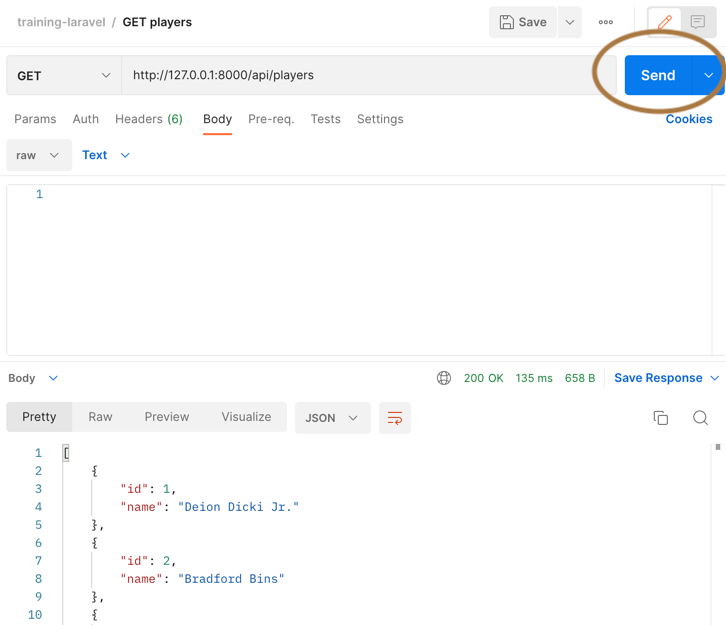

# Laravel 研修

## 用意する物

1. PHP 7.4, composer
    - Windows の場合
        - https://windows.php.net/download#php-7.4
        - https://getcomposer.org/doc/00-intro.md#using-the-installer
    - Mac の場合
        1. brew install php@7.4
        1. brew link php@7.4
        1. brew install composer
1. Docker
    - Docker をインストールする
    - https://www.docker.com/
1. Postman
    - API クライアントに使用する
    - https://www.postman.com/downloads/
    - 利用するために、postman の無料ユーザー登録をする。
1. DB クライアント
    - Windows の場合
        - HeidiSQL https://www.heidisql.com/download.php
    - Mac の場合
        - SequelPro https://sequelpro.com/

## 初期設定

1. `.env.example` を `.env`にリネームする
1. `docker-compose up`を実行する
1. コンテナの中に入る
    ```
    docker-compose exec app bash
    ```
1. 次のコマンドを実行して依存ライブラリをインストールする
    ```
    composer update
    composer install
    ```
1. MySQL 上に players テーブルを作成する
    ```
    php artisan migrate --seed
    ```
1. `ctrl + d` を入力して、コンテナからログアウトする。

### 小ワザ

-   既存のテーブルを作り直して、データも同時に投入する。
    -   `php artisan migrate:refresh --seed`

## Postman の初期設定

1. `training-laravel.postman_collection.json` を Postman にインポートする

## ゲームサーバー起動

```
docker-compose up
```

ゲームサーバーが起動したら、Postman を起動して send ボタンでゲームサーバーへリクエストを投げてみる。

レスポンスとしてプレイヤー情報が返ってきたら OK。


